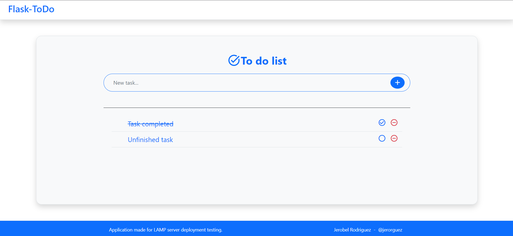
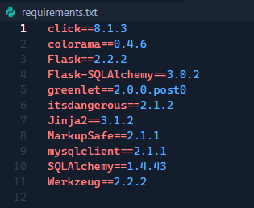
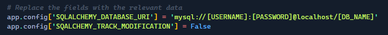

# Flask-Todo App

***Language***
* [🇪🇸 Español](README.es.md)
* 🇺🇸 English

# Overview
This application has been created for the tutorial [Deployment of Flask-Python application on LAMP server](https://github.com/jerorguez/flask-lamp-deployment). 

The application consists of a list of tasks with database connection through ORM.

# Usage requirements
The following packages have been installed for the operation of the application:
* Flask (micro-Framework Python)
* Flask-SQLAlchemy (ORM)
* MySQLClient (mysql interface for Python)

All packages are located in the **`requirements.txt`**

It is necessary to create a user and a database for the correct operation. The connection to it will be configured in the file **`__init__.py`**.

**\_\_init\_\_.py**

---
Jerobel Rodriguez - [@jerorguez](https://github.com/jerorguez)
